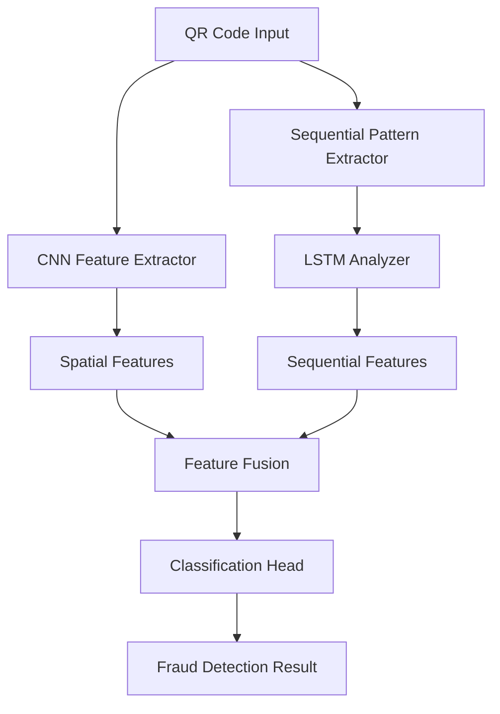

# SecurePayQR: AI-Powered QR Code Fraud Detection


## 🚀 Overview

SecurePayQR is a fraud detection system that combines deep learning and computer vision to identify tampered QR codes in real-time. The system uses a novel CNN-LSTM hybrid architecture to analyze both spatial features and sequential patterns in QR codes, achieving high accuracy in detecting various tampering attacks.

### Key Features

- 🧠 **Advanced AI**: CNN-LSTM hybrid architecture for superior detection accuracy
- ⚡ **Real-time Processing**: Sub-second inference with ONNX optimization
- 🌐 **Web Interface**: Modern React frontend with camera integration
- 📊 **Analytics Dashboard**: Comprehensive monitoring and historical analysis
- 🔐 **Production Ready**: Docker deployment with MongoDB, Redis, and monitoring
- 📱 **Mobile Friendly**: Responsive design for all devices
- 🛡️ **Secure**: Authentication, input validation, and rate limiting

## 🏗️ Architecture



### Technology Stack

| Component | Technology | Purpose |
|-----------|------------|---------|
| **ML Framework** | PyTorch + ONNX | Model training and inference |
| **Backend API** | FastAPI + Python | RESTful API services |
| **Database** | MongoDB | Document storage and analytics |
| **Cache** | Redis | Session management and caching |
| **Frontend** | React.js + Tailwind CSS | Modern web interface |
| **Deployment** | Docker + Docker Compose | Containerized deployment |
| **Monitoring** | Prometheus + Grafana | Metrics and observability |
| **Reverse Proxy** | Nginx | Load balancing and SSL |

## 🔧 Quick Start

## 📁 Project Structure

```
securepayqr/
├── 🐳 docker-compose.yml          # Multi-service orchestration
├── 🐳 Dockerfile                  # Multi-stage container builds
├── 📋 requirements.txt            # Python dependencies
├── 📊 README.md                   # This file
│
├── 🧠 src/                        # Source code
│   ├── cnn_lstm_model.py         # Core ML model architecture
│   ├── training_pipeline.py      # Model training orchestration
│   ├── dataset_creation_script.py # Synthetic data generation
│   ├── fastapi_backend.py        # REST API server
│   └── mongodb_backend.py        # MongoDB integration
│
├── ⚛️ frontend/                   # React.js frontend
│   ├── src/
│   │   ├── components/           # React components
│   │   ├── context/             # State management
│   │   └── App.js              # Main application
│   ├── public/                  # Static assets
│   └── package.json            # Frontend dependencies
│
├── 🧪 tests/                     # Test suites
│   ├── test_framework.py        # Comprehensive testing
│   ├── test_api.py              # API endpoint tests
│   ├── test_models.py           # Model unit tests
│   ├── test_integration.py      # End-to-end tests
│   └── test_performance.py      # Performance benchmarks
│
├── 🚀 scripts/                   # Deployment automation
│   ├── deploy.sh                # Main deployment script
│   └── init_mongo.js            # Database initialization
│
├── 📊 monitoring/                # Observability stack
│   ├── prometheus/              # Metrics collection
│   └── grafana/                 # Visualization dashboards
│
└── 🔧 nginx/                     # Reverse proxy configuration
    ├── nginx.conf               # Main configuration
    └── default.conf             # Site configuration
```


### Prerequisites

- Docker 24.0+ and Docker Compose
- 8GB+ RAM (4GB minimum)
- 10GB+ disk space

### Development Setup

1. **Clone the repository**
```bash
git clone https://github.com/your-username/securepayqr.git
cd securepayqr
```

2. **Start development environment**
```bash
chmod +x scripts/deploy.sh
./scripts/deploy.sh dev
```

3. **Access the application**
- API: http://localhost:8000
- API Documentation: http://localhost:8000/docs
- Frontend: http://localhost:3000
- Grafana: http://localhost:3000 (admin/admin123)

### Production Deployment

```bash
# Configure environment
cp .env.example .env
# Edit .env with your production settings

# Deploy production stack
./scripts/deploy.sh prod
```

## 📊 Model Performance

| Metric | Score | Description |
|--------|-------|-------------|
| **Accuracy** | 96.2% | Overall classification accuracy |
| **Precision** | 97.8% | True positive rate |
| **Recall** | 95.4% | Sensitivity to tampering |
| **F1-Score** | 96.6% | Harmonic mean of precision/recall |
| **Inference Time** | ~280ms | Average processing time |
| **Model Size** | ~45MB | ONNX model file size |

### Supported Attack Types

- ✅ Digital overlays and stickers
- ✅ Module manipulation attacks
- ✅ Print-scan degradation simulation
- ✅ Environmental condition attacks
- ✅ Partial occlusion attempts
- ✅ Gradient overlay attacks
- ✅ Logo/watermark insertion


## 🚀 Usage

### API Endpoints

#### Single QR Detection
```bash
curl -X POST "http://localhost:8000/detect" \
  -H "Authorization: Bearer your-token" \
  -F "file=@qr_code.png"
```

#### Batch Processing
```bash
curl -X POST "http://localhost:8000/detect/batch" \
  -H "Authorization: Bearer your-token" \
  -F "files=@qr1.png" \
  -F "files=@qr2.png"
```

#### Health Check
```bash
curl "http://localhost:8000/health"
```

### Frontend Usage

1. **Navigate to Scanner**: Use camera or upload image
2. **Real-time Detection**: Point camera at QR code
3. **View Results**: Confidence scores and detailed analysis
4. **Analytics**: Historical data and trend analysis

### Training Custom Models

```bash
# Generate training dataset
python src/dataset_creation_script.py --num_valid 2000 --output_dir ./data

# Train model
python src/training_pipeline.py \
  --dataset_dir ./data \
  --epochs 50 \
  --batch_size 16 \
  --use_wandb

# Export to ONNX
python -c "
from src.cnn_lstm_model import export_to_onnx, create_securepayqr_model
model = create_securepayqr_model()
export_to_onnx(model, 'model.onnx')
"
```

## 🔍 Monitoring & Observability

### Prometheus Metrics
- `securepayqr_requests_total` - Total API requests
- `securepayqr_detections_total` - Detection results by type
- `securepayqr_model_inference_seconds` - Inference latency
- `securepayqr_request_duration_seconds` - Request duration

### Grafana Dashboards
- **API Performance**: Request rates, latency, error rates
- **Detection Analytics**: Fraud rates, confidence distributions
- **System Health**: Resource usage, database metrics
- **Business Intelligence**: Usage patterns, trends

### Log Analysis
```bash
# View application logs
docker-compose logs -f api

# View detection logs
curl "http://localhost:8000/detection-logs?limit=100"

# Monitor real-time metrics
curl "http://localhost:8000/metrics"
```

## 🧪 Testing

```bash
# Run full test suite
python -m pytest tests/ -v --cov=src

# Run specific test categories
python -m pytest tests/test_models.py -v
python -m pytest tests/test_api.py -v
python -m pytest tests/test_integration.py -v

# Performance benchmarks
python -m pytest tests/test_performance.py -v
```

## 🚀 Deployment

### Development
```bash
./scripts/deploy.sh dev
```

### Production
```bash
./scripts/deploy.sh prod
```

### Available Commands
```bash
./scripts/deploy.sh backup              # Create data backup
./scripts/deploy.sh restore backup.tar  # Restore from backup
./scripts/deploy.sh update              # Update deployment
./scripts/deploy.sh logs api            # View service logs
./scripts/deploy.sh status              # Check service status
./scripts/deploy.sh cleanup             # Clean resources
```

## 🔐 Security

- **Authentication**: JWT-based API authentication
- **Input Validation**: File type and size restrictions
- **Rate Limiting**: Request throttling per client
- **CORS Protection**: Configurable origin policies
- **SQL Injection**: NoSQL injection prevention
- **Container Security**: Non-root user execution
- **Network Security**: Internal service communication

## 📈 Performance Optimization

### Model Optimization
- **ONNX Export**: 3x faster inference
- **Quantization**: Reduced model size
- **Batch Processing**: Optimized throughput
- **GPU Support**: CUDA acceleration

### Infrastructure Optimization
- **Redis Caching**: Session and result caching
- **Connection Pooling**: Efficient database connections
- **Load Balancing**: Nginx reverse proxy
- **Compression**: Gzip response compression

## 🤝 Contributing

1. Fork the repository
2. Create a feature branch (`git checkout -b feature/amazing-feature`)
3. Commit changes (`git commit -m 'Add amazing feature'`)
4. Push to branch (`git push origin feature/amazing-feature`)
5. Open a Pull Request

### Development Workflow

```bash
# Setup development environment
python -m venv venv
source venv/bin/activate  # On Windows: venv\Scripts\activate
pip install -r requirements.txt

# Install pre-commit hooks
pre-commit install

# Run tests before committing
python -m pytest tests/ -v
```

## 📜 License

This project is licensed under the MIT License - see the [LICENSE](LICENSE) file for details.

## 📞 Support

- **Documentation**: [Wiki](https://github.com/your-username/securepayqr/wiki)
- **Issues**: [GitHub Issues](https://github.com/your-username/securepayqr/issues)
- **Discussions**: [GitHub Discussions](https://github.com/your-username/securepayqr/discussions)
- **Email**: support@securepayqr.com

## 🙏 Acknowledgments

- [PyTorch](https://pytorch.org) for the deep learning framework
- [FastAPI](https://fastapi.tiangolo.com) for the high-performance API framework
- [React](https://reactjs.org) for the modern frontend framework
- [MongoDB](https://mongodb.com) for the flexible database solution

---

**Made with ❤️ for secure digital payments**